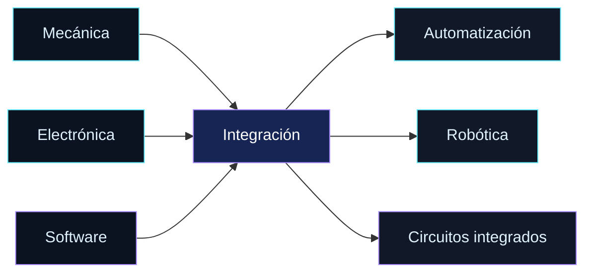

# Hola, soy Brayan Carrillo 👋

<div align="center">

  

  <br />

  
  <a href="https://github.com/Brayanc24?tab=followers">
    
  </a>

</div>

## ✦ Sobre mí

```ts
const yo = {
  nombre: "Brayan Carrillo",
  ubicación: "Panamá",
  rol: "Estudiante de Ingeniería Mecatrónica",
  actualmente: "Cursando el cuarto año y formando parte del centro de investigación CITIC",
  contacto: "brayanlor507@gmail.com",
};
```

<div align="center">

  [](https://www.linkedin.com/in/brayan-carrillo-630a52249)
  [](mailto:brayanlor507@gmail.com)

</div>

## ✦ Lo que estoy haciendo

- 🔭 Explorando la integración de la **mecánica, la electrónica y la informática**
- 🌱 Aprendiendo sobre **automatización industrial, robótica y diseño de circuitos integrados**
- 🤝 Abierto a colaborar en proyectos interesantes
- ⚡ Me interesa convertir retos de ingeniería en soluciones prácticas

## ✦ Mi área en una mirada

<div align="center">

  
  
  
  

</div>



## ✦ Mis estadísticas

<div align="center">

  
  

</div>

<div align="center">

  

</div>

## ✦ Lenguajes, frameworks y herramientas

<div align="center">

  

</div>

<div align="center">

  `Altium` · `KLayout` · `LOGOS (PLC)` · `Ladder` · `Fusion 3D` · `Proteus`

</div>

**Idiomas:** Español · Inglés · Portugués

<div align="center">

  
  
  
  

</div>

## ✦ Formación y áreas de interés

<div align="center">

  
  
  

</div>

- 🎓 Ingeniería Mecatrónica — Universidad Nacional de Panamá
- 🧪 Miembro del centro de investigación CITIC
- 🏅 Formación complementaria en biorrobótica, máquinas eléctricas y automatización industrial
- 🔬 Cursos de diseño y fabricación de circuitos integrados y dispositivos semiconductores en CIDESI México

## ✦ Mis proyectos y repositorios

<div align="center">

  <a href="https://github.com/Brayanc24/tt-advanced-template-bidir">
    
  </a>
  <a href="https://github.com/Brayanc24/Brayanc24">
    
  </a>

</div>

<table align="center">
  <tr>
    <td width="50%" align="center">
      <strong>⚙️ Diseño digital</strong><br />
      Flip-flop bidireccional avanzado<br />
      
    </td>
    <td width="50%" align="center">
      <strong>🧰 Perfil técnico</strong><br />
      Ingeniería, automatización y electrónica<br />
      
    </td>
  </tr>
</table>

<div align="center">

  <a href="https://github.com/Brayanc24?tab=repositories">
    
  </a>

</div>

## ✦ Cómo pienso un proyecto

<div align="center">

  
  
  
  

</div>

> Una buena solución conecta el mundo físico con el digital: sensores, control, código y una idea clara del problema.

## ✦ Mi actividad

<div align="center">

  

</div>

## ✦ Un pequeño mensaje

<div align="center">

> «El código también puede ser una forma de contar historias.»


<sub>Hecho con ☕, curiosidad y muchas líneas de código.</sub>

</div>
